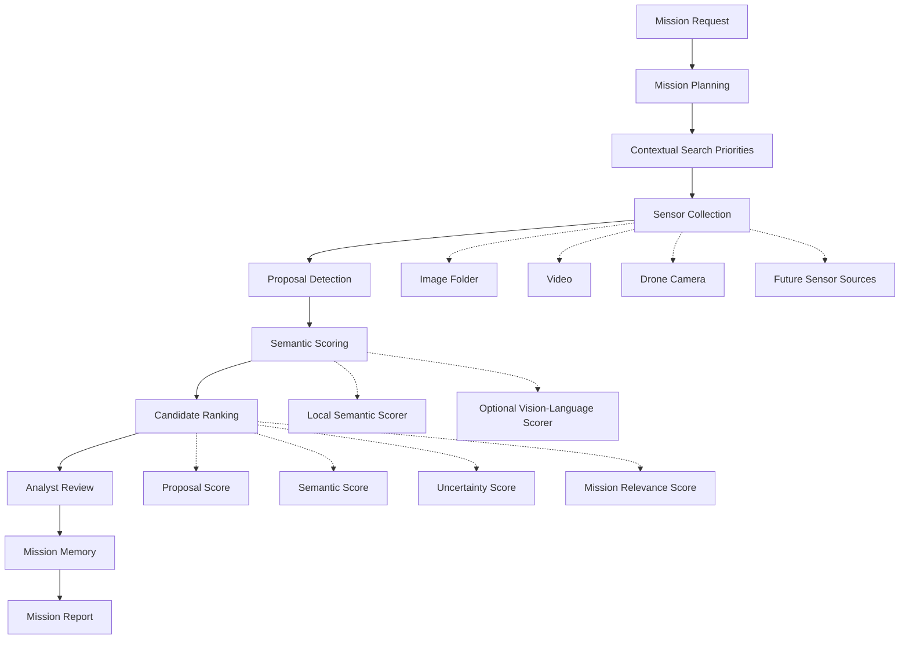

# Mission Intelligence Layer

Mission intelligence platform for robotic and sensor systems.

Mission Intelligence Layer helps operators convert large volumes of sensor data into prioritized findings, analyst decisions, mission memory, and structured mission reports.

The platform combines mission planning, contextual search priorities, proposal detection, semantic analysis, candidate ranking, analyst review, and mission memory into a single workflow. Current validation uses drone simulation, image/video benchmarks, and PX4/Gazebo integration paths, but the architecture is designed to support multiple sensor sources including drones, fixed cameras, robotics platforms, acoustic sensors, telemetry feeds, and recorded datasets.

This repository is for simulation, autonomy workflow development, and perception evaluation. It is not flight-control firmware and should not be connected directly to real motors.

## Why This Exists

Modern missions can generate thousands of images, video frames, detections, and sensor observations.

Human operators often have to review that evidence manually. Important findings can be missed while analysts spend time sorting through irrelevant frames, ambiguous detections, or low-quality sensor outputs.

Mission Intelligence Layer focuses on deciding which observations deserve attention while preserving uncertain evidence for review. The goal is not to remove the operator. The goal is to help the operator move faster, miss less, and leave behind a useful mission record.

## System Architecture



PX4, Gazebo, dashboards, cameras, videos, and future sensor feeds are integration points. The mission intelligence layer is the product.

Low-level vehicle control stays separated from mission reasoning. Perception scoring does not directly control a vehicle; it produces reviewable evidence and mission reports.

## Core Concepts

**Mission Planning**
Converts plain-English objectives into structured mission commands, operating modes, target descriptions, confirmation policies, and link-loss behavior.

**Contextual Search Priorities**
Infers likely places to search first based on mission context. A vehicle mission, person search, vessel search, debris search, and signal search should not all be treated as the same generic grid problem.

**Proposal Detection**
Uses lightweight local detection to find candidate regions before heavier semantic review. Current proposal layers include color-based detection, high-recall detection, and objectness-style proposals.

**Semantic Scoring**
Scores candidate crops and full frames against the mission request. The system supports a local semantic scorer and an optional OpenAI-backed vision scorer for stronger open-vocabulary review.

**Candidate Ranking**
Separates confirmed matches from review preservation. A likely match ranks high, uncertain evidence stays reviewable, scorer failures remain visible, and rejected crops can trigger full-frame review.

Each candidate receives an explicit ranking object:

```json
{
  "proposal_score": 0.81,
  "semantic_score": 0.67,
  "uncertainty_score": 0.43,
  "mission_relevance_score": 0.74,
  "review_priority": 0.72
}
```

The analyst queue is sorted by `review_priority`.

**Analyst Review**
Provides a human decision layer for approving, rejecting, or investigating candidates. Review decisions are saved beside mission reports.

**Mission Memory**
Summarizes previous reports and analyst decisions to expose recurring false positives, recurring misses, weak categories, and recommended benchmark data to collect next.

**Mission Reports**
Generates structured JSON and HTML reports covering mission understanding, contextual planning, vision strategy, candidate results, metrics, and stage health.

## System Principles

**Human In The Loop**
The platform assists operators. It does not remove oversight from high-stakes search, rescue, inspection, or security workflows.

**Resilient By Design**
No single component should erase the mission.

- Detector fails -> preserve the frame and continue reporting.
- Crop is wrong -> run full-frame semantic review.
- Semantic scorer times out -> keep the candidate for review.
- Dashboard fails -> reports and review files remain on disk.
- Benchmark fails on one mission -> the suite records the error and continues.

The preferred failure mode is degraded confidence and more review, not silent misses.

**Mission Intelligence Before Drone Simulation**
The drone simulator is a validation platform. The broader system is a reusable mission intelligence layer for robotic and sensor workflows.

## Example Workflow

```text
Mission: Search for a missing person near a shoreline
  -> Mission planner extracts target, urgency, context, and operating mode
  -> Context planner prioritizes likely locations
  -> Sensor source provides imagery or video
  -> Proposal detector generates candidate observations
  -> Semantic scorer reviews crops and full frames
  -> Candidate ranking sorts the analyst queue
  -> Analyst approves, rejects, or investigates findings
  -> Mission report is generated
  -> Mission memory records patterns and weaknesses
```

## Current Capabilities

- Plain-English mission objective parsing
- Mission command generation with operating modes
- Contextual search priority planning
- Search mission state machines for simulated robotic workflows
- PX4/Gazebo helper scripts for drone-based validation
- Fast dashboard simulation for command, telemetry, alerts, and logs
- Image and video mission evaluation
- Vision benchmark suite across mission types
- Color, high-recall, and objectness proposal detection
- Local semantic scoring interface
- Optional OpenAI vision-language scoring backend
- Full-frame fallback review for detector misses and rejected crops
- Candidate ranking with review-priority explanations
- Analyst dashboard for reviewing candidates, metrics, reports, and mission memory
- Mission memory summaries from past reports and analyst decisions
- JSON and HTML mission reports
- Structured logs, debug images, candidate crops, and review files
- Safety-oriented mission concepts: return-home, geofence, abort, manual override, and link-loss policy

## Analyst Dashboard

Run:

```bash
./scripts/run_analyst_dashboard.sh
```

Open:

```text
http://localhost:8010
```

The dashboard provides:

- saved mission and vision reports
- mission planning from a plain-English request
- candidate queue and shortlist review
- confidence scores and review-priority reasons
- precision, recall, F1, and capture-recall metrics
- approve, reject, and investigate review states
- mission memory from previous reports and analyst decisions

Review decisions are saved beside each report:

```text
candidate_reviews.json
```

Example decision record:

```json
{
  "candidate_id": "0042_shoreline_frame",
  "decision": "reject",
  "reason": "shoreline debris",
  "notes": "Bright clutter, no vessel structure visible",
  "updated_at": "2026-06-05T12:00:00Z"
}
```

## Benchmarking

The benchmark suite is designed to evaluate the system across mission contexts, not just one detector task.

Current active benchmarks:

- people in aerial/grass imagery
- vehicles in aerial/incident-response imagery
- DroneVehicle RGB and infrared vehicle labels

Configured dataset placeholders:

- boats and water/shoreline search
- debris and incident scenes
- distress signals and markers
- fire and smoke
- structure damage and blocked access
- animals or livestock

Each benchmark should include:

- positives
- near misses
- hard negatives
- small or partially occluded targets
- confusing context that should not be over-prioritized

Run the configured suite:

```bash
./scripts/run_mission_benchmark_suite.sh
```

Convert a YOLOv8 person dataset into Aegis benchmark labels:

```bash
./scripts/import_yolo_person_benchmark.sh "/path/to/yolo_dataset"
```

This generates:

```text
datasets/benchmarks/people/sard_labels.csv
```

Analyze and import the DroneVehicle RGB/infrared dataset:

```bash
./scripts/analyze_dronevehicle_benchmark.sh "/path/to/VisDrone-DroneVehicle"
./scripts/import_dronevehicle_vehicle_benchmark.sh "/path/to/VisDrone-DroneVehicle"
```

This generates:

```text
datasets/benchmarks/vehicles/dronevehicle_rgb_labels.csv
datasets/benchmarks/vehicles/dronevehicle_ir_labels.csv
datasets/benchmarks/vehicles/dronevehicle_stats.json
docs/DRONEVEHICLE_BENCHMARK_ANALYSIS.md
```

The suite writes:

```text
logs/mission_benchmark_suites/<timestamp>/mission_benchmark_suite_report.json
logs/mission_benchmark_suites/<timestamp>/mission_benchmark_suite_report.html
```

The key benchmark distinction is:

- **Confirmed-match metrics:** how often the system confidently identifies the target.
- **Analyst-capture metrics:** how often the system preserves the right evidence for review.

For mission workflows, missing a possible target is usually worse than showing an analyst a few extra uncertain images.

Recent SAR benchmark:

- evaluated 5,712 annotated search-and-rescue images
- ran a full local triage pass across the complete dataset
- tested two smaller OpenAI review samples instead of sending the full dataset to the API
- improved API-sample capture precision from 70% to 91% with review-priority sampling
- kept capture recall near 90%, meaning likely person evidence was still preserved for analyst review

Benchmark snapshot:

| Benchmark | Images | Review Strategy | Capture Precision | Capture Recall |
|---|---:|---|---:|---:|
| SAR local triage | 5,712 | local full-dataset pass | 83.7% | 69.8% |
| SAR API review | 200 | review-priority sample | 91.0% | 89.7% |
| Vehicle local triage | 43 | local category baseline | 34.6% | 81.8% |
| DroneVehicle RGB local subset | 500 | local vehicle proposals | 50.0% | 100.0% |
| DroneVehicle RGB API review | 100 | review-priority sample | 73.2% | 95.3% |
| DroneVehicle IR local subset | 500 | local vehicle proposals | 89.4% | 100.0% |
| DroneVehicle IR API review | 100 | review-priority sample | 61.1% | 100.0% |

Vehicle modality recommendation:

| Modality | Best Current Strategy | Why |
|---|---|---|
| RGB vehicles | selective API semantic review | improves capture precision from 50.0% to 73.2% while keeping recall high |
| IR vehicles | local hot-blob triage | keeps 89.4% capture precision and 100.0% capture recall; API over-keeps thermal clutter |

DroneVehicle benchmark readiness:

- generated separate RGB and infrared vehicle labels
- 28,439 RGB images and 28,439 infrared images
- 28,439 detectable RGB/IR pairs
- 953,164 vehicle annotations
- 56,040 positive image cases and 838 negative image cases
- precision can be measured directly from this dataset

Recent benchmark direction:

- full-frame fallback significantly improved target capture
- vehicle benchmark performance improved strongly after crop-reject fallback
- DroneVehicle RGB/IR local proposal baselines now preserve likely vehicle evidence instead of returning zero detections
- RGB API review improved capture precision from 50.0% to 73.2% while keeping capture recall high at 95.3%
- IR API review preserved recall but reduced precision, so thermal review needs a stricter prompt or threshold before it beats local triage
- remaining work is reducing noisy RGB review items further and tuning thermal API review against hard negatives

Latest people-search benchmark notes:

```text
docs/SARD_BENCHMARK_REPORT.md
```

Latest vehicle benchmark notes:

```text
docs/VEHICLE_BENCHMARK_REPORT.md
docs/DRONEVEHICLE_BENCHMARK_ANALYSIS.md
docs/DRONEVEHICLE_RGB_BENCHMARK_REPORT.md
docs/DRONEVEHICLE_IR_BENCHMARK_REPORT.md
docs/DRONEVEHICLE_RGB_API_BENCHMARK_REPORT.md
docs/DRONEVEHICLE_IR_API_BENCHMARK_REPORT.md
docs/LINKEDIN_POST_AEGIS_VEHICLE_MODALITY_BENCHMARK.md
docs/PORTFOLIO_AEGIS_MODALITY_INTELLIGENCE.md
```

Next platform expansion:

```text
Aegis Vision Intelligence
+ Aegis Infrared Intelligence
+ Aegis Acoustic Intelligence
```

The vehicle modality benchmark makes acoustic/sonar sensing the next logical expansion: a non-visual evidence stream that can use the same mission-memory, benchmark, and analyst-review workflow.

## Mission Memory

Mission memory reads past reports and analyst review decisions to summarize what the platform is learning operationally.

Example shape:

```json
{
  "recurring_false_positives": ["grass", "grey objects", "white vehicles"],
  "recurring_misses": ["partially hidden person", "small distant vehicle"],
  "common_false_positive_causes": ["vegetation", "shadow", "debris"],
  "common_uncertainty_causes": ["too small"],
  "sensor_modality_lessons": [
    "RGB vehicle evidence benefits from selective API semantic review.",
    "Infrared vehicle evidence currently performs better with local hot-blob triage."
  ],
  "weak_categories": ["boats", "smoke", "signals"],
  "recommended_data": ["shoreline vessel imagery", "hard-negative smoke/fog examples"]
}
```

This is not model training yet. It is operational learning: the system records where it is weak, what it tends to over-prioritize, which analyst reason tags keep appearing, and what benchmark data should be collected next.

## Mission Evaluation

Run the full mission-intelligence loop over image or video evidence:

```bash
./scripts/run_mission_evaluation.sh "/path/to/images" \
  --mission-request "Search the shoreline for a missing person wearing an orange life vest" \
  --labels-csv "/path/to/labels.csv"
```

Run with OpenAI semantic vision:

```bash
./scripts/run_mission_evaluation.sh "/path/to/images" \
  --mission-request "Search the shoreline for a missing person wearing an orange life vest" \
  --labels-csv "/path/to/labels.csv" \
  --semantic-vision openai \
  --openai-detail high \
  --full-frame-semantic misses
```

The evaluator writes:

```text
logs/mission_evaluations/<timestamp>/mission_evaluation_report.json
logs/mission_evaluations/<timestamp>/mission_evaluation_report.html
```

The report combines mission command parsing, contextual search priorities, vision planning, candidate detection, semantic scoring, evaluation metrics, and stage health.

Each mission report includes:

- mission objective
- search area
- evidence collected
- candidates found
- analyst decisions
- performance metrics
- mission memory
- recommendations

## Optional Vision-Language Scoring

The local semantic scorer is intentionally conservative. It ranks candidates but does not claim exact arbitrary object recognition. For stronger open-vocabulary testing, the project supports an optional OpenAI-backed vision scorer.

Set up local credentials. The `.env` file is ignored by Git and should not be committed:

```bash
cp .env.example .env
```

Then edit `.env`:

```text
OPENAI_API_KEY=your_api_key_here
OPENAI_VISION_MODEL=gpt-4o
OPENAI_IMAGE_DETAIL=auto
```

Check the environment:

```bash
./scripts/check_openai_vision_env.sh
```

## Simulation And Drone Validation

The lightweight dashboard simulation:

```bash
python3 server.py
```

Open:

```text
http://localhost:8000
```

Fast scenario tests:

```bash
./scripts/run_fast_sim_tests.sh
```

PX4/Gazebo validation scripts:

```bash
./scripts/check_px4_env.sh
./scripts/run_red_block_world.sh
./scripts/run_red_block_gui.sh
./scripts/run_px4_camera_standalone.sh
./scripts/run_uxrce_agent.sh
./scripts/run_search_mission.sh
./scripts/check_ros2_env.sh
./scripts/start_camera_bridge.sh
./scripts/verify_camera_feed.sh
./scripts/debug_camera_frame.sh
```

PX4 remains responsible for low-level stabilization and flight control. Mission logic should call controller interfaces, not publish raw flight-control messages directly.

## Technology Stack

- Python
- OpenCV
- HTML/CSS/JavaScript dashboard
- JSON/CSV mission logs and reports
- PX4/Gazebo validation path
- ROS 2 integration path
- Optional OpenAI vision-language scoring

Core modules live in `autonomy/`:

- `mission_command.py`: mission command and operating-mode policy
- `mission_objective.py`: plain-English objective parsing
- `contextual_search_plan.py`: contextual priority planning
- `mission_vision_plan.py`: mission-specific perception plan
- `vision_lab.py`: image/video benchmark runner
- `semantic_vision.py`: semantic scoring interface
- `mission_evaluation.py`: full mission evaluation pipeline
- `mission_benchmark_suite.py`: benchmark suite runner
- `mission_memory.py`: report and analyst-review memory
- `world_model.py`: local grid map of searched cells, candidates, and confidence
- `px4_controller_interface.py`: ROS 2/PX4 Offboard wrapper

## Tests

Run focused mission-intelligence tests:

```bash
python3 tests/test_vision_lab.py
python3 tests/test_mission_memory.py
python3 tests/test_yolo_benchmark_importer.py
python3 tests/test_yolo_obb_vehicle_importer.py
python3 tests/test_dronevehicle_benchmark_analysis.py
python3 tests/test_dronevehicle_importer.py
python3 tests/test_analyst_server.py
python3 tests/test_mission_benchmark_suite.py
python3 tests/test_mission_evaluation.py
python3 tests/test_semantic_vision.py
python3 tests/test_contextual_search_plan.py
python3 tests/test_vision_report_viewer.py
```

Run core autonomy tests:

```bash
python3 tests/test_autonomy_stack.py
python3 tests/test_search_mission.py
python3 tests/test_world_model.py
```

## Roadmap

Near-term:

- add real dashboard screenshots and benchmark screenshots to this README
- collect broader labeled datasets for boats, debris, signals, fire/smoke, structure damage, and animals
- improve candidate ranking to reduce noisy review items while preserving capture recall
- improve analyst review workflow and report browsing
- keep expanding mission memory into practical recommendations

Medium-term:

- rename the repository to `mission-intelligence-layer`
- add cleaner sensor abstraction for folders, videos, live cameras, drone cameras, and future acoustic sources
- support disconnected/edge collection with host-side semantic review after reconnect or return
- add richer report export for portfolio/demo use

Architecture details and longer-term dataset priorities are tracked in:

```text
docs/MISSION_INTELLIGENCE_ROADMAP.md
```

## Safety

This project is simulation-first. For any future hardware work, start with bench tests, props-off tests, tethered hover, manual flight, assisted waypoint flight, and only then controlled autonomous tests in a legal area with permission.

Keep human override, logging, geofencing, and return-home behavior in the loop.
